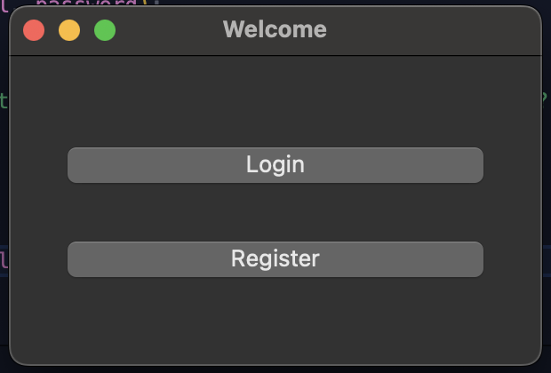
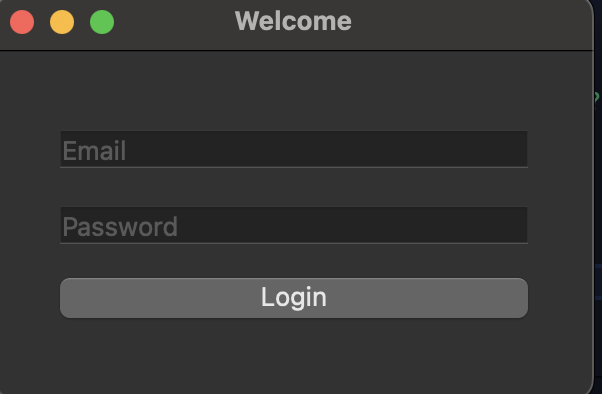
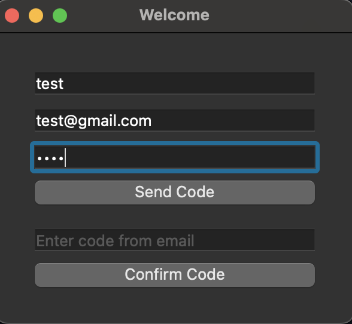
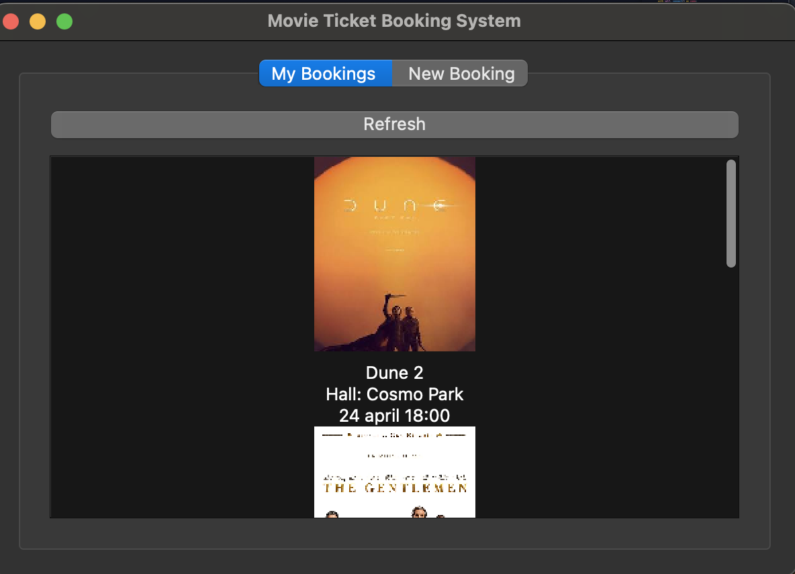
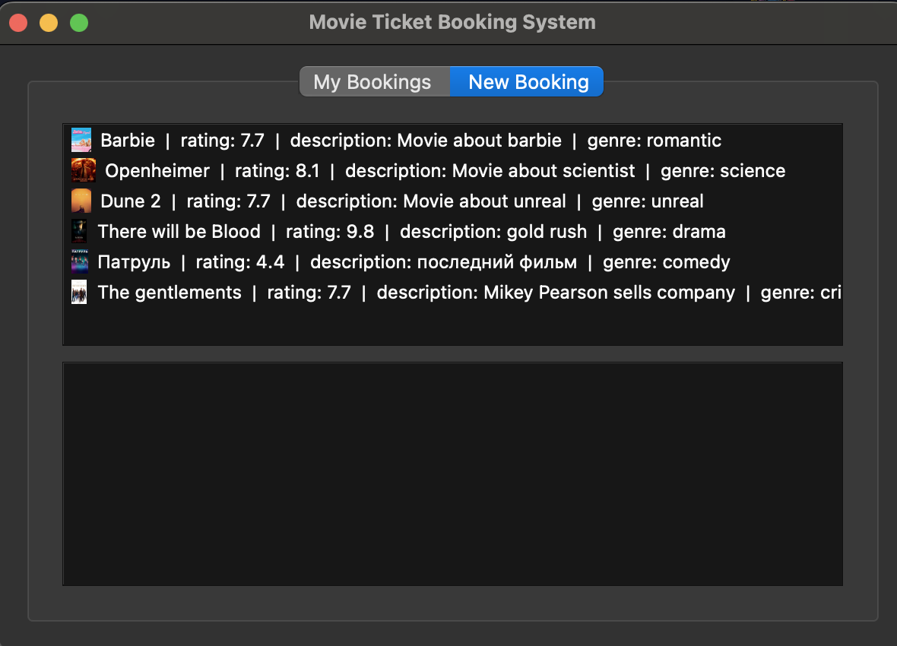
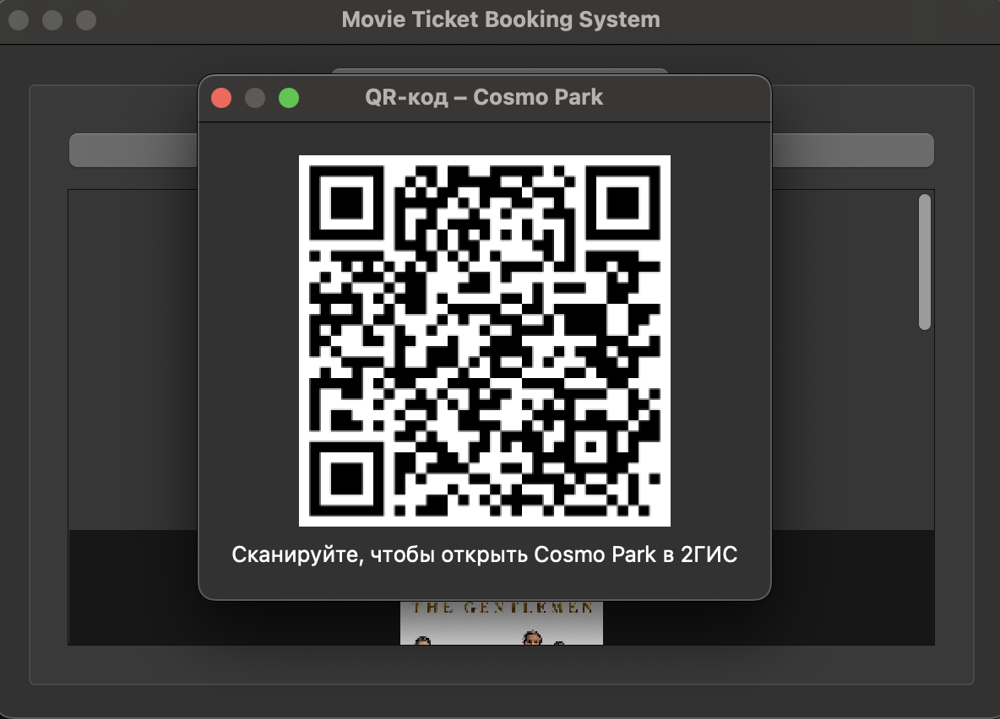

# Movie Ticket Booking System

## Description
A lightweight desktop application (PyQt 6 + SQLite) for booking movie tickets.  
Users register via e‑mail (single‑use verification code), browse movies, pick a screening and view their personal booking history.  
Classic **MVC** stack: **Model** – DAO + SQLite, **View** – PyQt6, **Controller** - account + booking logic
---

## Features

1. E‑mail registration with one‑time code |
2. Login (e‑mail + password) |
3. DAO layer with full CRUD for 4 tables |
4. Movie list with poster thumbnails |
5. Screening list for a selected movie |
6. Seat‑availability check and automatic `seats_left` decrement |
7. My Bookings tab (user’s history) |
8. Refresh button – realtime data reload |
9. Double‑click booking ➜ QR‑code linking to 2GIS map of the hall |
10. Unit tests for model layer|
11. SMTP e‑mail sending with `.env` secrets |

Team & Roles

**Rakhatbekov Meder** Solo developer: database design, model/DAO, controllers, PyQt GUI, tests, docs |

| Auth menu (Login / Register) |  |
| Login menu |  |
| Register menu|  |
| My bookings |  |
| New Bookings |  |
| QR‑code|  |

Requirements: 
1. Pyqt6
2. Pillow
3. dotenv
4. qrcodes

## Quick Start

git clone https://github.com/your‑repo/movie‑booking.git
cd fp/
pip install requirements
python main.py
